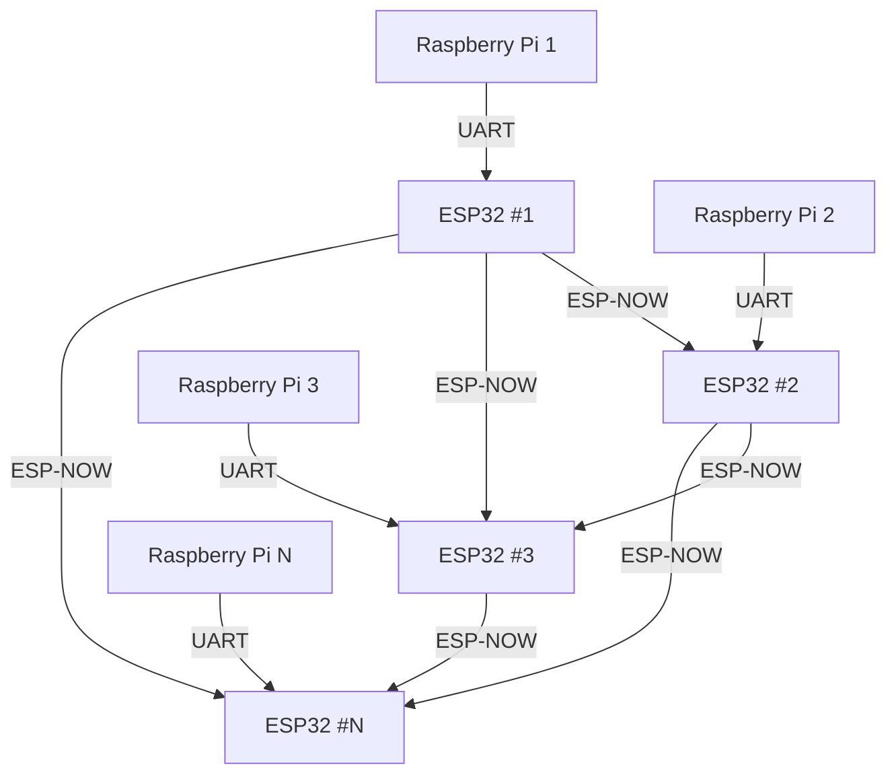

# Clover Swarm ESP-NOW Communication System

A comprehensive communication module for swarm drone interaction using ESP-NOW protocol. This system enables real-time communication between multiple drones through ESP32 modules, providing reliable packet transmission, collision avoidance, and coordinated flight capabilities.

## Table of Contents

- [Overview](#overview)
- [System Architecture](#system-architecture)
- [Repository Structure](#repository-structure)
- [Setup Instructions](#setup-instructions)
  - [ESP32 Firmware](#esp32-firmware)
  - [Raspberry Pi Python Libraries](#raspberry-pi-python-libraries)
- [Usage Examples](#usage-examples)
- [Testing](#testing)
- [Troubleshooting](#troubleshooting)

---

## Overview

This module provides swarm drone interaction capabilities through ESP-NOW communication. Each drone is equipped with an ESP32 module that handles wireless packet transmission between drones, while the Raspberry Pi manages flight control and mission logic. The system supports:

- Real-time telemetry broadcasting
- Custom message transmission
- Collision avoidance algorithms
- Coordinated swarm behavior
- Automatic drone discovery

## System Architecture



**Communication Flow:**
1. Raspberry Pi sends commands/messages to ESP32 via UART
2. ESP32 broadcasts packets to all other ESP32 modules via ESP-NOW
3. Receiving ESP32 modules forward packets to their respective Raspberry Pi

## Repository Structure

```
clover-swarm-espnow/
├── esp/                          # ESP32 firmware
│   ├── src/                      # Source code
│   │   ├── main.cpp             # Main firmware entry point
│   │   ├── ESPNowManager.cpp    # ESP-NOW communication manager
│   │   ├── ConfigManager.cpp    # Configuration management
│   │   ├── PacketDeserializer.cpp # Packet parsing utilities
│   │   ├── Statistics.cpp       # Network statistics
│   │   └── telemetry_generator.cpp # Telemetry data generation
│   ├── data/                    # Configuration files
│   │   ├── config.json         # General configuration
│   │   └── espnow_config.json  # ESP-NOW specific settings
│   ├── platformio.ini          # PlatformIO build configuration
│   └── test/                   # Firmware tests
├── skyros/                      # Python library for Raspberry Pi
│   ├── src/skyros/             # Main library source
│   │   ├── drone.py            # Main drone interface
│   │   ├── collision_avoidance/ # Collision avoidance algorithms
│   │   └── drone_data.py       # Data structures
│   ├── examples/               # Usage examples
│   │   ├── example.py          # Basic usage example
│   │   ├── complex_example.py  # Advanced swarm coordination
│   │   └── example_stress_usage.py # Stress testing
│   └── test/                   # Python library tests
│       ├── stationary.py       # Stationary drone testing
│       ├── stress.py           # Network stress testing
│       └── network_performance_test.py # Performance benchmarks
└── esp_controller/             # ESP32 controller firmware for OTA
```

## Setup Instructions

### ESP32 Firmware

**Note:** These instructions are for development and firmware updates. On pre-configured drones, the ESP32 firmware should already be installed and working.

#### 1. Hardware Connections

Connect Raspberry Pi UART4 to ESP32C3 super mini UART1:
- **TX** (RPi GPIO8) → **RXD** (ESP GPIO3/D3)
- **RX** (RPi GPIO9) → **TXD** (ESP GPIO4/D4)
- **CTS** (RPi GPIO10) → **RTS** (ESP GPIO5/D5)
- **RTS** (RPi GPIO11) → **CTS** (ESP32 GPIO6/D6)
- **VCC** (RPi 5V) → **VCC** (ESP32 5V)
- **GND** (RPi GND) → **GND** (ESP32 GND)

#### 2. Build and Flash

**Option A: Build from source**
```bash
cd esp/
pio run --target upload -e esp32c3_super_mini_prod --upload-port /dev/PORT
```

**Option B: Flash pre-built binary**
```bash
# Download latest release binary
Download instructions can be requested from the organizers. # A link will be added soon

# Flash using esptool
esptool.py --chip esp32c3 --port /dev/PORT --baud 921600 \
  --before default_reset --after hard_reset write_flash \
  0x0 firmware.bin
```

#### 3. First Boot Note

On the first flash, ESP32-C3 may take up to 30 seconds to initialize the SPIFFS filesystem. This is normal—please wait for the process to complete and do not power off or interrupt the board during this time.

### Raspberry Pi Python Libraries

#### 1. Enable UART on RPi

Edit `/boot/config.txt`:
```
[all]
dtoverlay=pi3-disable-bt
dtoverlay=uart0,ctsrts
dtoverlay=uart4,ctsrts
enable_uart=1
```

Disable Bluetooth:
```bash
sudo systemctl disable hciuart
sudo systemctl disable bluetooth
```

Reboot RPi4:
```bash
sudo reboot
```

#### 2. Install Python Library

```bash
cd skyros/
pip install -e .
```

#### 3. Deploy to Multiple Drones

For deploying Python code to multiple drones simultaneously, see [Ansible Deployment Guide](skyros/ansible_deployment.md) for automated deployment using Ansible.

## Usage Examples

The `skyros/examples/` directory contains comprehensive examples demonstrating different use cases:

### Basic Usage (`example.py`)
- Simple drone initialization and basic flight commands
TODO: добавить про отправку custom message
- Network discovery and status monitoring
- Basic collision avoidance navigation

### Complex Swarm Coordination (`complex_example.py`)
- Master-slave drone coordination
- Custom message handling for coordinated behavior
- Individual drone targeting and control

### Stress Testing (`example_stress_usage.py`)
- Network performance under load
- Multiple drone coordination scenarios
- Telemetry monitoring and drone expiration
- Advanced network status tracking
- Useful only for debugging and checking network performance.

### Key Features Demonstrated:
- **Drone Discovery**: Automatic detection of other drones via telemetry
- **Collision Avoidance**: Built-in algorithms for safe swarm flight
- **Custom Messaging**: Broadcast and targeted message transmission
- **Network Monitoring**: Real-time status and performance tracking
- **Coordinated Flight**: Synchronized takeoff, navigation, and landing

## Advanced Testing

### Stationary Testing (`skyros/test/stationary.py`)

For troubleshooting network issues, use the stationary test:

1. **Setup**: Place drones on ArUco markers in a controlled environment
2. **Run**: Execute the stationary test on each drone
3. **Monitor**: The test provides real-time information about:
   - Network connectivity status
   - Discovered drone positions and distances
   - Collision avoidance vector calculations
   - Telemetry packet reception
   - Message transmission success rates

**Usage:**
```bash
cd skyros/test/
python stationary.py
```

**Output includes:**
- Distance measurements between drones
- Position coordinates of all discovered drones
- Collision avoidance vectors
- Network latency and packet statistics
- Real-time telemetry data

### Additional Test Suites

- **`network_performance_test.py`**: Network throughput and latency benchmarks
- **`stress.py`**: High-load network stress testing
- **`esp_simple_test.py`**: ESP32 firmware functionality verification

Start TestMAin.py

